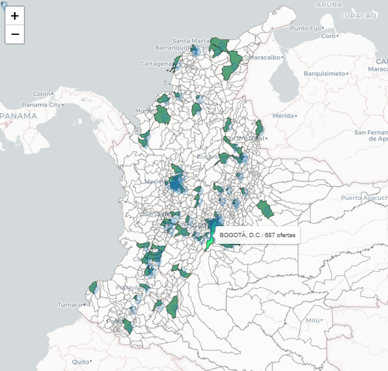
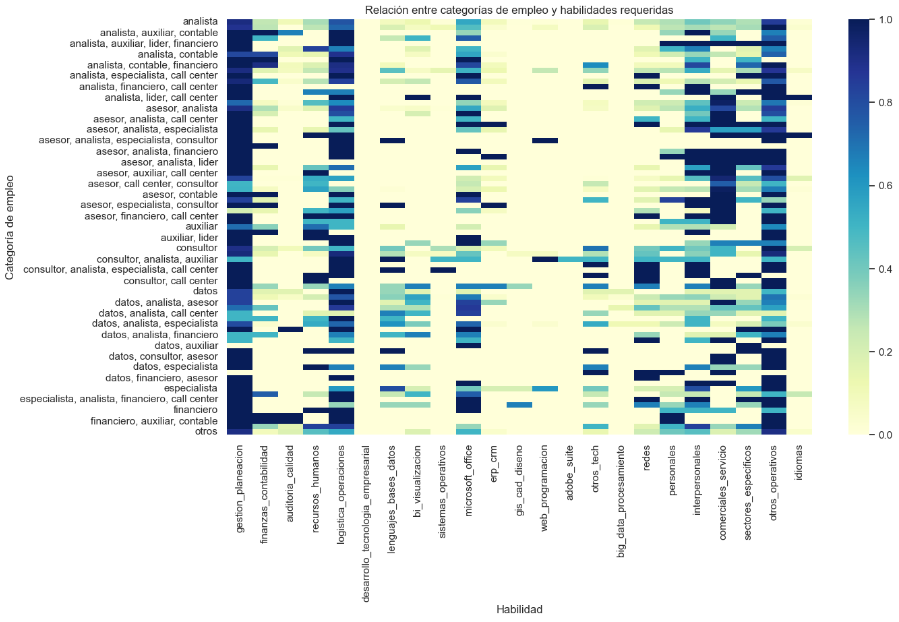
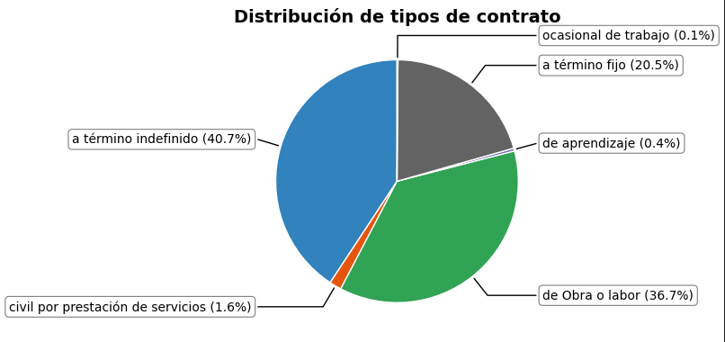

# Ofertas computrabajo

### Descripción

Este proyecto busca clasificar y analizar la información de las  ofertas laborales en Colombia en el campo de "analistas de datos", extrayendo información desde ***computrabajo*** mediante **web scraping**, realizando una limpieza, transformación y generación de variables para un análisis exploratorio de los datos. 

La información obtenida permitira observar la oferta en el mercado de analistas de datos, cuáles son las habilidades que las empresas buscan en el puesto.

### 🧱 Estructura del proyecto

```text
📁 proyect_offers_jobs
│
├── 📁 data
│   ├── ofertas_computrabajo.csv/    # Datos crudos obtenidos del scraping
│   ├── clean_offers.csv/            # Datos limpios y transformados
│   ├── Municipios.json/             # Datos externos
│   └── conteo_ciudades.csv/         # Datos externos
├── 📁 src
│   └──📄 requirements.txt
├── 📁 notebooks
│   ├── 01_scraping_computrabajo.ipynb      # Scrapping
│   ├── 02_cleaning.ipynb                   # Limpieza de datos y transformados
│   ├── 03_modelo_rf.ipynb                  # Modelo Random forest
│   ├── EDA.ipynb                           # Análisis de datos exploratorios
│   ├── README.ipynb                        # Resúmen del proyecto
│   └── README2.ipynb                       # Resúmen más profundo + explicación del modelo rf
│
├── 📄 .gitattributes
└── 📄 .gitignore

### Análisis del proyecto

Mediante herramientas como web scrapping, manejo de expresiones regulares, lematización y un modelo simple de ML se construyó una BBDD que permita un análisis descriptivo sobre el mercado de analistas en Colombia (de las ofertas publicadas en computrabajo
).                                                                                                     

###  🛠️ Tecnologías usadas

- Python 🐍
- Pandas / Numpy
- Matplotlib / Seaborn
- Scikit-learn
- BeautifulSoup / Selenium
- Jupyter Notebook

### Habilidades

- Web scrapping
- Extracción y limpieza de datos  
- Manejo de expresiones regulares
- Lematización  
- Análisis exploratorio de datos (EDA)  
- Visualización de datos  
- Modelado con regresión  

### Resultados


Se puede observar el mercado de los "analistas" de una manera general, clara y uniforme, mediante una limpieza y posteriormente una exploración, para generar vistas e hipotesís.

Por ejemplo, en la siguiente vista se puede observar dónde y cantidad de ofertas de analista. 



Incluso podemos observar las habilidades requeridas según el cargo o los puesto aproximado






## 🚀 Cómo ejecutar el proyecto

### Clonar repositorio

git clone https://github.com/johnalarconpol/offers_jobs.git

Crear entorno virtual e instalar dependencias:

pip install -r requirements.txt

Ejecutar los scripts de scraping:

Ejecutar notebooks 


### Recomendaciones

Ejecutar en jupyter notebook.


